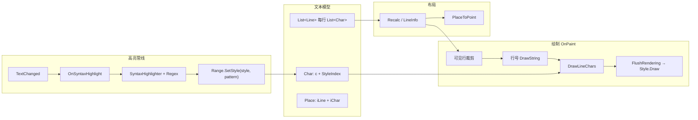

# CodeBoxWidget 实现指南

> **受众**：重构 `Addons/EBoyTerminal/Widgets/CodeBoxWidget.cs` 的开发者与 AI Agent。  
> **参考库**：[FastColoredTextBox（FCTB）](https://github.com/PavelTorgashov/FastColoredTextBox) — .NET WinForms 上的语法高亮文本编辑器，完全用 **C# + GDI+** 自绘，不依赖 RTF/RichTextBox。  
> **宿主对照**：Survivalcraft 2 `TextBoxWidget`（`GameDir/Widget/TextBoxWidget.cs`）。

---

## 1. 目标

为月之终端脚本编辑器提供：

| 能力 | 说明 |
| --- | --- |
| 多行编辑 | 已有（继承 `TextBoxWidget`） |
| 顶对齐 + 纵向滚动 | 当前仅有 hack，需正式实现 |
| 行号栏 | 左侧固定宽度，与正文同步滚动 |
| 语法高亮 | Lua（MoonSharp 宿主语言），可扩展 |
| 性能 | 大文件（`MaximumLinesCount = 512`）下输入不卡顿 |

本指南**蒸馏** FCTB 的设计思想，并给出在 SC2 `DrawContext` / `FontBatch2D` 上的落地路径；**不**直接引用 WinForms 或 GDI+ 依赖。

---

## 2. 现状分析

### 2.1 `CodeBoxWidget`（26 行）

```csharp
public override void Draw(DrawContext dc) {
    Vector2 actual = ActualSize;
    float lineHeight = Font.GlyphHeight * FontScale * Font.Scale + FontSpacing.Y;
    m_actualSize = new Vector2(actual.X, lineHeight);
    try { base.Draw(dc); }
    finally { m_actualSize = actual; }
}
```

**意图**：把 `ActualSize.Y` 临时改成「一行高」，让宿主 `Draw_` 里 `currentDrawPosition = (0, ActualSize.Y / 2)` 近似顶对齐。

**问题**：

- 反射式改 `m_actualSize` 脆弱，与布局/命中测试/IME 候选窗坐标可能不一致。
- 未解决**纵向滚动**（宿主只有水平 `Scroll`）。
- 无行号、无按字符/片段着色。
- 绘制仍是宿主 `NormalDrawItem` 单色系 `Color`。

### 2.2 宿主 `TextBoxWidget.Draw_` 要点

| 环节 | 行为 | 对重构的启示 |
| --- | --- | --- |
| 文本模型 | 单一 `string Text`，`\n` 分行 | 可继续用字符串作真源，另建「行表 + 样式表」 |
| 绘制 | `TextDrawItem` 链：`Normal` / `Selection` / `Caret` / `EndOfLine` | 可保留「分 pass 排队 → 一次 Transform」模式 |
| 颜色 | 全局 `Color` | 需改为按 **run**（连续同样式片段）入队 |
| 滚动 | 仅 `Scroll`（X），`Matrix.CreateTranslation(-Scroll, 0, 0)` | 需增加 `ScrollY`，行号区不随水平滚 |
| 垂直锚点 | 首行 Y = `ActualSize.Y / 2`（垂直居中一行） | 多行编辑器应改为 `PaddingTop + lineIndex * lineHeight - ScrollY` |
| 命中测试 | `CalculateClickedCharacterIndex` 同样用 `Y/2` 起算 | 重写时必须与绘制共用同一套 `LineMetrics` |
| 输入 | Caret、Selection、IME、`Update()` 键盘 | **优先复用**；只替换绘制与高亮层 |

### 2.3 使用方（`MoonTerminalScriptDialog`）

- 像素字体、`EnterAsNewLine`、`MaximumLinesCount = 512`、`IndentAsSpace`。
- 脚本语言为 **Lua** → 高亮规则可直接参考 FCTB `SyntaxHighlighter.LuaSyntaxHighlight`。

---

## 3. FastColoredTextBox 架构蒸馏

FCTB 的核心思想：**文本与样式分离存储，样式在 TextChanged 时由正则写入，绘制时按样式 run 批量 flush 到 GDI+**。



### 3.1 坐标与文本模型

#### `Place`（逻辑位置）

- `iLine`：行号（0-based）
- `iChar`：行内字符索引（0-based）

所有编辑、选区、高亮范围都用 `Place`，不用「全局字符偏移」作为主坐标（FCTB 也提供 `PositionToPlace` 互转）。

#### `Char`（字符 + 样式）

```csharp
public struct Char {
    public char c;
    public StyleIndex style;  // 位掩码，非枚举单值
}
```

- **不**把颜色写进字符串（对比 RichTextBox RTF）。
- 每个字符挂一个 `StyleIndex`；多种样式可叠加（位或），绘制时按位查找 `Styles[i]`。

#### `Line` / `LineInfo`

- `Line`：该行 `List<Char>` 及折叠标记等。
- `LineInfo`（布局缓存）：`startY`、`WordWrapStringsCount`、`wordWrapIndent` 等。
- **`Recalc()`** 在字体变化、换行、显示行号开关时重算 `LeftIndent`、`TextHeight`、滚动条范围。

### 3.2 样式系统

#### `Style` 抽象类

```csharp
public abstract void Draw(Graphics gr, Point position, Range range);
```

#### `TextStyle`（最常用）

- `ForeBrush` / `BackgroundBrush` / `FontStyle`
- `Draw` 内对 `range` 每个字符调用 `gr.DrawString(line[i].c.ToString(), font, brush, x, y)`
- 先 `FillRectangle` 背景，再逐字绘制前景

#### `StyleIndex` 位掩码

- `Styles` 数组最多 16（或 32）个样式槽。
- `FlushRendering` 遍历 mask 的每一位，对命中的 `Style` 调用 `Draw`。
- 若没有任何 `TextStyle` 命中，回退 `DefaultStyle`。

**蒸馏要点**：在 SC2 中不必逐字 `QueueText`；应对**连续相同 `StyleIndex` 的 run** 调用一次 `fontBatch.QueueText(substring, ...)`，前景色取自 `TextStyle` 映射。

### 3.3 语法高亮管线

#### 触发时机

```
用户编辑 → TextSource 变更 → OnTextChanged(args)
    → OnSyntaxHighlight(args)   // 同步，在 TextChanged 事件之前
    → SyntaxHighlighter.HighlightSyntax(Language, range)
```

#### 高亮范围策略（`HighlightingRangeType`）

| 模式 | 范围 | 用途 |
| --- | --- | --- |
| `ChangedRange` | 仅变更行 | 默认，增量 |
| `VisibleRange` | 可见区 ∪ 变更区 | 大文件 |
| `AllTextRange` | 全文 | 切换语言 |

#### `Range.SetStyle` 与正则

典型 Lua 流程（`SyntaxHighlighter.LuaSyntaxHighlight`）：

1. `range.ClearStyle(...)` — 清除变更区内旧样式位。
2. 按优先级依次：`SetStyle(StringStyle, LuaStringRegex)` → 注释 → 数字 → 关键字 → 函数名。
3. 后写的规则可覆盖先写规则（取决于 `SetStyle` 实现与是否允许叠加）。

正则中若含命名组 `(?<range>...)`，只高亮该组匹配部分（用于 `class Foo` 只加粗 `Foo`）。

#### 与 RichTextBox 的本质区别

> 颜色信息只存在控件内部；**每次文本变化都要重新跑高亮**。没有「带格式剪贴板」除非自行导出 HTML/RTF。

对 `CodeBoxWidget`：维护 `ushort[] lineStyles` 或 `List<StyledRun>` 缓存即可，**源文本仍用 `Text` 属性** 便于存档与 `ComponentMoonTerminal.ScriptText` 同步。

### 3.4 绘制管线（GDI+ `OnPaint`）

#### 整体顺序

1. `Recalc()` — 含行号区宽度。
2. 填充 padding / indent 背景。
3. 按**可见行**循环（`YtoLineIndex(VerticalScroll.Value)` 起）：
   - 行背景（当前行、修改标记）
   - **`ShowLineNumbers`**：见下节
   - 对每个 word-wrap 子行调用 **`DrawLineChars`**
4. 选区、括号高亮、折叠线、光标。

#### `DrawLineChars` — 性能关键

```
for each char in [firstChar..lastChar]  // 水平裁剪后的列范围
    if line[i].style != currentStyleIndex
        FlushRendering(...)  // 把上一段同样式 run 画出
FlushRendering(...)        // 最后一段
// 再画选区 SelectionStyle
```

- **水平裁剪**：`firstChar` / `lastChar` 由 `HorizontalScroll` 与客户端宽度算出，避免画屏外字符。
- **垂直裁剪**：`lineInfo.startY` 与 `VerticalScroll` 比较，`break` / `continue`。
- **按 run 绘制**：同一样式连续字符只 flush 一次，减少 GDI+ 调用。

#### `FlushRendering`

```csharp
for (int i = 0; i < Styles.Length; i++)
    if ((styleIndex & mask) != 0)
        Styles[i].Draw(gr, pos, range);
if (!hasTextStyle)
    DefaultStyle.Draw(gr, pos, range);
```

### 3.5 行号显示

#### 布局：`Recalc()` 扩大 `LeftIndent`

```csharp
long maxLineNumber = LinesCount + lineNumberStartValue - 1;
int charsForLineNumber = 2 + (maxLineNumber > 0 ? (int)Math.Log10(maxLineNumber) : 0);
if (ShowLineNumbers)
    LeftIndent += charsForLineNumber * CharWidth + minLeftIndent + 1;
```

- 行号栏占用左侧 **indent 区**，正文从 `LeftIndent + Paddings.Left` 起。
- 位数随最大行号动态增长，避免 `999` 与 `1000` 时错位。

#### 绘制：每可见行一次

```csharp
var lineNumber = iLine + (int)lineNumberStartValue;
e.Graphics.DrawString(
    lineNumberText, Font, lineNumberBrush,
    new RectangleF(-10, y, LeftIndent - minLeftIndent - 2 + 10, CharHeight + ...),
    new StringFormat(StringFormatFlags.DirectionRightToLeft) { LineAlignment = StringAlignment.Center });
```

- **右对齐**于行号栏矩形内（个位数与十位数右缘对齐）。
- `y` 与正文同行，随 `VerticalScroll` 偏移。
- 使用与正文相同的 `Font` / `CharHeight`，保证基线一致。

#### 蒸馏到 SC2

| FCTB | SC2 等价 |
| --- | --- |
| `LeftIndent` | `LineNumberGutterWidth`（像素，用 `Font.MeasureText("9999")` 估宽） |
| `DrawString` RTL | `fontBatch.QueueText(text, pos, ..., TextAnchor.Right)` |
| `LineNumberColor` | 单独 `Color`，通常比正文暗 |
| 与正文同步滚动 | 行号 Y 使用同一 `ScrollY`；X 固定在 `Margin.Left` |

### 3.6 `PlaceToPoint`（逻辑 → 像素）

```csharp
y = LineInfos[place.iLine].startY + wordWrapIndex * CharHeight - VerticalScroll.Value;
x = LeftIndent + Paddings.Left + (place.iChar - wrapStart) * CharWidth - HorizontalScroll.Value;
```

**所有**光标、选区、点击命中必须与该函数共用同一套 `LineInfo`，否则 caret 与高亮错位。

### 3.7 性能策略（值得照搬）

| 策略 | 说明 |
| --- | --- |
| 增量高亮 | 默认只高亮 `ChangedRange` 行 |
| 延迟事件 | `TextChangedDelayed`（定时器合并多次按键）用于折叠、括号等非关键路径 |
| 可见区绘制 | 只遍历 `startLine..endLine` |
| 水平裁剪 | `firstChar`/`lastChar` |
| Run 合并绘制 | `DrawLineChars` + `FlushRendering` |
| `BeginUpdate`/`EndUpdate` | 批量改文本只触发一次 `OnTextChanged` |
| 等宽假设 | FCTB 默认 `CharWidth` 固定；SC2 像素字体可强制等宽，非等宽需逐字 `MeasureText` |

---

## 4. GDI+ → Survivalcraft 2 映射

| FCTB (GDI+) | SC2 (`DrawContext`) |
| --- | --- |
| `Graphics.FillRectangle` | `FlatBatch2D.QueueQuad` |
| `Graphics.DrawString` | `FontBatch2D.QueueText` |
| `Graphics.DrawLine`（光标） | `FlatBatch2D.QueueQuad` 或 `QueueLine` |
| `Pen` / `SolidBrush` | `Color` 直接传入 batch |
| `SmoothingMode` | 像素字体用 `SamplerState.PointClamp`（对话框已设 `TextureLinearFilter = false`） |
| `ControlStyles.OptimizedDoubleBuffer` | Widget 树每帧绘制；靠裁剪 + 增量高亮减负载 |
| `AutoScroll` / `VerticalScroll` | 自管 `float ScrollY`，在 `Draw_` 与 `CalculateClickedCharacterIndex` 中减去 |
| `Invalidate()` | 无需；`IsDrawRequired = true` 每帧会画 |

### 4.1 推荐类结构（重构目标）

```
CodeBoxWidget : TextBoxWidget   // 或 Widget + 复制输入逻辑
├── LineLayout[]              // 每行 startY, height, text offset in Text
├── StyledRun[] per line      // 或 char-level StyleIndex[]
├── SyntaxHighlighterLua      // 正则规则，参考 FCTB
├── float ScrollY
├── int LineNumberGutterWidth
├── void RebuildLayout()
├── void HighlightChangedLines(int fromLine, int toLine)
├── override void Draw_(DrawContext dc)
│   ├── DrawGutterLineNumbers()
│   ├── DrawTextRuns()        // 按 run QueueText
│   ├── DrawSelection()
│   └── DrawCaret()
└── override 命中测试 / LimitScroll  // 与 Draw_ 共用 LineLayout
```

**最小可行阶段**：

1. **Phase A**：正式顶对齐 + `ScrollY`（不再 hack `m_actualSize`）。
2. **Phase B**：行号栏（无高亮）。
3. **Phase C**：Lua 关键字/字符串/注释高亮（正则 + run 绘制）。
4. **Phase D**：当前行背景、括号匹配（可选）。

---

## 5. Lua 高亮规则摘要（来自 FCTB）

实现 `SyntaxHighlighter.LuaSyntaxHighlight` 时的规则顺序：

1. `ClearStyle` 清除字符串/注释/数字/关键字/函数样式。
2. `SetStyle(StringStyle, LuaStringRegex)` — 单引号、双引号、`[[ ... ]]`。
3. `SetStyle(CommentStyle, LuaCommentRegex1..3)` — `--` 行注释与块注释。
4. `SetStyle(NumberStyle, LuaNumberRegex)`。
5. `SetStyle(KeywordStyle, LuaKeywordRegex)` — `and break do else elseif end false for function if in local nil not or repeat return then true until while` 等。
6. `SetStyle(FunctionsStyle, LuaFunctionsRegex)` — 标识符后跟 `(`。

括号：`CommentPrefix = "--"`，`LeftBracket/RightBracket` = `()`，`{}` 为第二对（折叠用，可选）。

**注意**：FCTB 正则需从 `InitLuaRegex()` 复制或对照源码；Lua 长字符串与嵌套注释需用测试用例验证。

---

## 6. 重构风险清单

| 风险 | 缓解 |
| --- | --- |
| 重写 `Draw_` 后 caret/选区错位 | 抽取共享 `LineLayout`，绘制与 `CalculateClickedCharacterIndex` 同源 |
| 仅水平滚动的宿主逻辑 | `ScrollY` 与 `LimitScrollValue` 扩展；行号不参与水平 scroll transform |
| 改 `Text` 时样式不同步 | `TextChanged` 里 `RebuildLayout` + `HighlightChangedLines` |
| 512 行 × 长行卡顿 | 可见区高亮 + run 绘制；避免每字符 `QueueText` |
| IME 组合文本 | 继续用宿主 `CompositionText`；高亮可跳过 composition 区间 |
| 存档 | 只存 `Text`；样式不持久化（与 FCTB 一致） |

---

## 7. 建议阅读顺序（源码）

### FCTB（GitHub）

| 文件 | 内容 |
| --- | --- |
| [Char.cs](https://github.com/PavelTorgashov/FastColoredTextBox/blob/master/FastColoredTextBox/Char.cs) | 字符 + StyleIndex |
| [Style.cs](https://github.com/PavelTorgashov/FastColoredTextBox/blob/master/FastColoredTextBox/Style.cs) | `TextStyle.Draw` 逐字 GDI+ |
| [SyntaxHighlighter.cs](https://github.com/PavelTorgashov/FastColoredTextBox/blob/master/FastColoredTextBox/SyntaxHighlighter.cs) | 各语言正则，`LuaSyntaxHighlight` |
| [FastColoredTextBox.cs](https://github.com/PavelTorgashov/FastColoredTextBox/blob/master/FastColoredTextBox/FastColoredTextBox.cs) | `OnPaint`、`DrawLineChars`、`PlaceToPoint`、`Recalc`、`OnSyntaxHighlight` |

### 宿主（`GameDir`）

| 文件 | 内容 |
| --- | --- |
| `Widget/TextBoxWidget.cs` | `Draw_`、`TextDrawItem`、`Scroll`、命中测试 |
| `Widget/LabelWidget.cs` | 多行 `FontBatch` 参考 |

### 本模组

| 文件 | 内容 |
| --- | --- |
| `Widgets/CodeBoxWidget.cs` | 待重构控件 |
| `Dialogs/MoonTerminalScriptDialog.cs` | 配置与持久化 |
| `Components/ComponentMoonTerminal.cs` | `ScriptText` 存档字段 |

---

## 8. 外部资料

- [FCTB README](https://github.com/PavelTorgashov/FastColoredTextBox)
- [CodeProject 原文](http://www.codeproject.com/Articles/161871/Fast-Colored-TextBox-for-syntax-highlighting)（架构说明与示例）
- [NuGet FCTB](https://www.nuget.org/packages/FCTB/)（仅作版本参考，**不要**在 SC2 模组中引用 WinForms 程序集）

---

*文档版本：2026-06-12 · 对应 `CodeBoxWidget` 脚手架阶段，供彻底重构前的设计对齐。*
