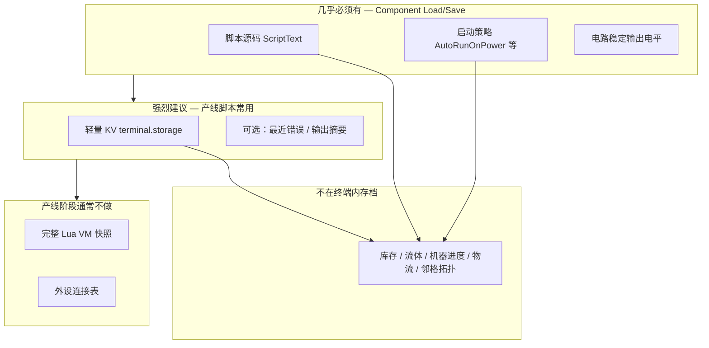

# 产线控制脚手架

> **定位**：嘉豪的终端（EBoyTerminal）在进入「像 OC/CC 一样读写 IE2 产线」阶段前的**最后一版脚手架文档**。  
> **基调锚点**：[策划案.md](策划案.md) · **编辑器**：[CodeBoxWidget实现指南.md](CodeBoxWidget实现指南.md) · **IE2 接入**：[SCIENEW 接口与联网 API 指南](../../docs/guides/SCIENEW-接口与联网API指南.md)（主仓）  
> **文档版本**：0.2 · 与模组 `0.2.0` 同期 · 2026-06

本文汇总：**现状盘点**、**与 OC/CC 的对照**、**存档/持久化边界**、**产线控制前的待办与里程碑**。实现产线 API 时应以本文为检查清单，避免方向漂移。

---

## 1. 一句话目标（产线控制阶段）

**在 IE2 已有设备网络之上，用月之终端里的 Lua 读现场、发指令，把工厂变成可编排系统——终端是工控机，不是第二套工业包。**

玩家身份是「自控工程师」：观察产线 → 写/改脚本 → 部署 → 产线按逻辑运转。详见策划案 §2–§5。

---

## 2. 脚手架现状（截至 0.1.0）

### 2.1 已具备

| 层级 | 内容 | 主要落点 |
| --- | --- | --- |
| 方块 | 月之终端：VoltNet 供电、五向电路 IO、面向放置 | `MoonTerminalBlock`、`MoonTerminalVoltElement` |
| Lua 运行时 | MoonSharp；协作式调度（`spawn`、`coroutine.yield` 秒/tick）；`require` | `LuaScriptHost`、`LuaMachine` |
| `terminal.*` | `print` / `write` / `clear`；输出缓冲；脚本 `ScriptText` 存档 | `ComponentMoonTerminal` |
| `terminal.electric.*` | 读输入、写输出、脉冲；Lua 库封装与等待辅助 | `ComponentMoonTerminalElectric`、`Assets/Lua/lib/terminal/electric.lua` |
| `terminal.screen.*` | 只读：是否链接 CRT、行列数、位置 | `ComponentMoonTerminalScreenProvider`、`TerminalScreenResolver` |
| 系统模块 | `sys.world`、`sys.version`；`ILuaSystemApiContributor` 可扩展 | `System/Contributors/*` |
| Lua 标准库 | `lib/async`、`lib/log`、`lib/util`、`lib/terminal/*` | `Assets/Lua/lib/` |
| UI | 脚本对话框：保存/运行/暂停/停止 | `MoonTerminalScriptDialog` |
| 编辑器 | 行号、Lua 高亮、撤销重做、纵向滚动 | `CodeBoxWidget`、`LuaCodeBoxWidget` |
| CRT 输出 | 链接 `IScreenContainerComponent` 后投屏显示 `print` 缓冲 | `ComponentMoonTerminalScreenProvider` |
| 示例 | `Samples/smoke_test.lua`、`Samples/monitor_example.lua` | — |
| 测试（主仓） | 运行时调度、`require`、yield 等 | `SCIENEW.Tests/EBoyTerminal/LuaScriptHostRuntimeTests.cs` |

### 2.2 架构扩展点（已实现、待填充）

| 机制 | 用途 | 现状 |
| --- | --- | --- |
| `ILuaScriptApiProvider` | 同实体 Component 向 `terminal` 表注入 API | 终端、电路、屏幕已用 |
| `ILuaSystemApiContributor` | `require("sys.*")` 系统级只读模块 | world、version |
| `PeripheralRegistry` + `IPeripheral` | 对标 CC Peripheral / OC Adapter | **仅有接口与空注册表，无实现、无 Lua 调用面** |

### 2.3 刻意未做（属产线阶段）

- 邻格/网络 **IE2 设备外设**（库存、流体、合成进度、物流等）
- **外设发现、`peripheral.call` 式 API**
- 产线向 API 清单与用户文档（`API.md`）

### 2.4 P0 已完成（0.2.0）

| 项 | 说明 |
| --- | --- |
| **合成配方** | `EBoyTerminal.ier`（TEDC + CRT + 真值表 + 高级电路，4 行后期配方） |
| **AutoRunOnPower** | `ComponentMoonTerminal` Save/Load；对话框复选框 |
| **terminal.storage** | `ComponentMoonTerminalStorage` + `lib/terminal/storage.lua` |

---

## 3. 与 OC / CC 的对照：缺什么才叫「能控产线」

| 维度 | ComputerCraft / CC:T | OpenComputers | 月之终端现状 |
| --- | --- | --- | --- |
| 程序载体 | 电脑 + 可选磁盘 | 整机 + 文件系统 | 单实体 `ScriptText` |
| 外设模型 | Peripheral 侧向连接 | Adapter + 驱动 | 未实现 |
| 读产线 | 箱子、机器、红石等 API | 大量 mod 驱动 | 仅 **本机** `terminal.electric` + **只读** `sys.world` |
| 开机行为 | startup / autostart | BIOS / 磁盘引导 | 需玩家点「运行」；掉电 `StopScript` |
| 运行中状态 | 常持久化 VM | 整机状态进档 | **不**持久化 VM；Load 后仅编译到 `Ready` |
| 产线物理状态 | 在世界方块/实体里 | 同左 | 应在 **IE2 Component**，不在 Lua 堆 |

**结论**：脚手架已具备「写脚本、接电、摸电路、上 CRT」；距离策划案愿景差在 **外设层 + 启动策略 + 少量控制状态存盘**，而不是先复制 OC 整机快照。

---

## 4. 存档与持久化：要存什么、不存什么

产线控制前须统一边界，避免把「Lua 虚拟机」和「工厂状态」混在同一层。

### 4.1 三层模型

### 4.2 当前存盘行为

| 数据 | 是否进世界存档 | 说明 |
| --- | --- | --- |
| `ScriptText` | ✅ | `ComponentMoonTerminal` Save/Load |
| `MaxOutputLines` | ✅ | 同上 |
| 电路 **稳定** 输出电平 | ✅ | `ComponentMoonTerminalElectric.OutputVoltagesKey` |
| Lua 全局/局部变量、协程栈 | ❌ | Load 时 `ReloadFromSource` 仅编译，不恢复运行 |
| 运行/暂停/错误状态 | ❌ | 读档后等同「已编译未启动」 |
| 终端输出缓冲 | ❌ | 内存态 |
| 脉冲计时 | ❌ | 运行时态；读档可接受丢失或文档声明 |
| 外设绑定 | — | 将来靠 **邻格扫描**，不写绑定表 |

`ComponentLuaScriptHost` 注释已明确：**Load 或保存时不同步执行玩家代码**。

### 4.3 决策原则

1. **一定要有**  
   - 脚本源码（已有）  
   - 电路稳定输出（已有）  
   - **启动策略**（待做）：如 `AutoRunOnPower`；Load 完成且有 VoltNet 供电时自动 `StartScript()`  

2. **建议有（优先于整 VM 快照）**  
   - **`terminal.storage` 类 KV**：计数器、阶段号、阈值、冷却标记等；Component 对称 Save/Load  
   - 脚本风格约定：**有状态写 storage，无状态写 `while true` + 读 IE2 现场**  

3. **通常不需要（至少 v0.x）**  
   - MoonSharp 整 VM / 协程堆栈序列化（userdata、C# 回调、版本升级难兼容）  
   - 在 Lua 里镜像库存、液位等产线数据  
   - 用 `IESettings.xml` 存世界内进度（违反主仓 world-save-persistence 规则）  

4. **外设连接**  
   - 与 CC 相同：**物理邻接即连接**，读档后重新 scan，不序列化连接表  

### 4.4 典型脚本与存盘需求

| 脚本模式 | 是否需要 VM 快照 | 建议 |
| --- | --- | --- |
| `while true` 读仓 + 写电路 | 否 | AutoRun + 读 IE2 API |
| 多阶段状态机（`phase = 2`） | 否 | `terminal.storage` |
| `lib.async.debounce` 等内存表 | 否 | 重启可丢或迁到 storage |
| 海龟式逐步物理动作（若未来有） | 视情况 | 优先 storage 记步数，最后再考虑极简运行态 |

---

## 5. 产线控制前待办（优先级）

### P0 — 可玩闭环（✅ 已完成）

| # | 项 | 说明 |
| --- | --- | --- |
| 1 | **合成配方** | `EBoyTerminal.ier` |
| 2 | **AutoRunOnPower** | 对话框「通电自动运行」 |
| 3 | **terminal.storage（MVP）** | Component JSON 存盘 + Lua API |

### P1 — 第一个外设 MVP（产线控制起点）

**建议从邻格库存只读开始**（策划案：「先连一台设备、读一个数」）：

- C#：扫描六邻格 `IInventory`（或实体 `Component`）  
- Lua：`terminal.peripheral.scan()` → 列表；`inventory.list()` / `get(slot)`  
- 不必一次做全网 discovery；类型名 + 坐标即可  

随后按价值扩展（见主仓接口指南）：

| 方向 | IE2 接入点 |
| --- | --- |
| 物流/仓储 | `IInventory`、`ComponentInserter` |
| 流体 | `ITank` / `ComponentTankBase` |
| 电力网 | `SubsystemVoltNet`（读本机以外节点） |
| 合成/机器 | `ICrafterComponent` |
| 机械 | `SubsystemEnginePower`、`IEngineComponent` |
| 电路 | 已有 `terminal.electric`；可加输入变化轮询/事件封装 |

**实现模式**：

- 邻格实体实现 `IPeripheral` + 方法表，或统一 `PeripheralBridge` 扫描  
- Lua 薄封装：`require("lib.peripheral.chest")` 等，与 `lib.terminal.electric` 风格一致  
- `PeripheralRegistry` 登记类型，但 **连接关系不存档**  

### P2 — 编辑器与可诊断性

- 编译错误行号 → 编辑器跳转（解析 MoonSharp `DecoratedMessage`）  
- 运行态显示（`LuaMachineState`、`ActiveCoroutineCount`）  
- 未保存关闭确认  
- 对话框内嵌加载 `Samples/*.lua`  

### P3 — CRT / screen API（可选）

- 定点写入、颜色（当前仅 `print` 缓冲 + 固定绿色）  
- 多屏：`TerminalScreenResolver` 现只取 `screens[0]`  

### P4 — 工程与文档

- 子模块或主仓补充产线 API 的集成测试（外设 mock）  
- 新增 `API.md`（Lua 面 + 版本策略）  
- csv 行为名 `MoonTerminalBlockBehavior` 与 `SubsystemMoonTerminalBlockBehavior` 若加载有警告则统一  

---

## 6. 推荐实施顺序

**若只能选三件事**：

1. `moonterminal` 合成配方  
2. 邻格箱子/机器 **只读** 库存 API  
3. `AutoRunOnPower` + 错误行跳转（或 storage MVP）  

---

## 7. 产线阶段 API 设计约束

实现 P1 时须遵守：

1. **代码控制现场，不控制菜单**（策划案 §4）— API 读写产线真实状态，不是改 UI 数字。  
2. **渐进式开放** — 先只读再写入，先邻格再扩展。  
3. **失败可诊断** — 错误进终端输出；静默失败禁止。  
4. **存档边界** — 世界内数据走 Entity Component Load/Save；跨存档选项才考虑外部 XML。  
5. **附属模组边界** — 优先扩展与适配器，不大改 IE2 核心。  
6. **Screen 几何** — 改 `Screen` / Provider 绘制时遵循主仓 `AGENTS.md` 的源码对照与既有 `Screen` 契约；纹理用 `Screen.QuadRasterizerState`，3D 文字用 `Screen.FontRasterizerState`。

---

## 8. 里程碑（建议）

| 版本 | 目标 | 交付物 |
| --- | --- | --- |
| **0.1.x**（当前） | 脚手架 | 本文档所列「已具备」项 |
| **0.2.0** | 可生存使用 | ✅ 配方 + AutoRun + storage MVP |
| **0.3.0** | 首个产线闭环 | 邻格库存只读 + 示例脚本（缺料告警/补料请求原型） |
| **0.4.0** | 扩展外设 | 流体或合成进度二选一 + `API.md` |
| **0.5.0+** | 编排增强 | 多外设、screen 增强、联机权限（若需要） |

---

## 9. 自检清单（开产线 PR 前）

- [ ] 新持久化字段是否在 **Component** Save/Load 对称？  
- [ ] 是否误用 `IESettingsManager` 存世界内进度？  
- [ ] 产线状态是否从 **IE2 Component** 读取，而非只在 Lua 变量里？  
- [ ] 外设连接是否靠 **邻格/拓扑** 而非存档绑定表？  
- [ ] 掉电 / Load 行为是否与 `AutoRun` 策略一致且可测？  
- [ ] 示例脚本是否可在「供电 + 邻格放箱子/CRT」下跑通？  
- [ ] 主仓 `SCIENEW.Tests/EBoyTerminal` 是否覆盖新 API 的关键路径？  

---

## 10. 相关文件索引

| 路径 | 说明 |
| --- | --- |
| `Components/ComponentMoonTerminal.cs` | 脚本、输出、AutoRun |
| `Components/ComponentMoonTerminalStorage.cs` | EEPROM 式 `terminal.storage` |
| `Components/ComponentLuaScriptHost.cs` | 运行时；Load 不执行玩家代码 |
| `Components/ComponentMoonTerminalElectric.cs` | 电路 IO 与稳定输出存档 |
| `Peripherals/IPeripheral.cs` | 外设接口（待实现） |
| `Runtime/LuaScriptHost.cs` | require、模块路径 |
| `Assets/Lua/lib/` | 脚本侧标准库 |
| `Samples/` | 冒烟与监控示例 |
| `SCIENEW.Tests/EBoyTerminal/` | 主仓运行时测试 |

---

*本文档为产线控制阶段的脚手架锚点；具体 API 签名与实现步骤在 `API.md`（待写）中展开。若与 [策划案.md](策划案.md) 冲突，以策划案基调为准。*
